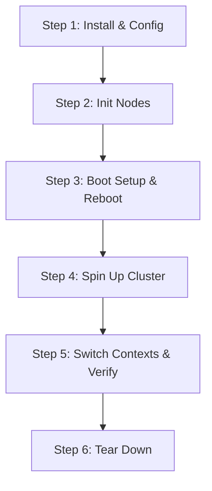

# Devpod Usage Skill & End-to-End Setup Guide

This skill guides you on how to use `devpod`, a local edge development orchestrator. Use this guide to walk users through setting up a devpod cluster from start to finish—including configuration, node initialization, boot-level setups, provisioning, and context management.

---

## Complete End-to-End Setup Guide

Setting up an edge-development cluster with `devpod` follows a structured 6-step lifecycle:



### Step 1: Install & Configure Devpod

Before starting, install the required prerequisites on your local machine:
- **Docker**: Required for building images and running local containerized clusters.
- **kubectl**: Kubernetes CLI tool.
- **sailr**: Build and packaging tool.

1. **Build and Install Devpod**:
   Clone the repository and install it locally using Cargo:
   ```bash
   cargo install --path .
   ```

2. **Initialize a Project Configuration**:
   Create a new project workspace by running:
   ```bash
   devpod init --name my-edge-cluster
   ```
   This generates a boilerplate `devpod.toml` file in the current directory.

3. **Configure Your Cluster Nodes**:
   Open `devpod.toml` and configure your remote environment. Below is a production-ready template for a multi-node cluster (a control plane server and a worker agent) utilizing dual Tailscale and LAN connectivity:
   ```toml
   [project]
   name = "my-edge-cluster"

   [cluster.production-van]
   provider = "k3s"
   connection = "ssh"
   user = "admin"

   [[cluster.production-van.nodes]]
   role = "server"
   name = "control-1"
   bootstrap_address = "192.168.1.10"
   runtime = "containerd"

   [[cluster.production-van.nodes]]
   role = "agent"
   name = "worker-1"
   bootstrap_address = "192.168.1.11"
   runtime = "containerd"

   [cluster.production-van.access]
   mode = "dual" # Access via Tailscale and LAN
   primary = "tailscale"
   lan_domain = "local"
   published_ports = [
     { node = "control-1", port = 6443, protocol = "TCP", name = "k8s-api" }
   ]

   [cluster.production-van.tailscale]
   enabled = true
   tailnet_domain = "example.ts.net"
   auth_key_env = "TAILSCALE_AUTH_KEY"
   api_key_env = "TAILSCALE_API_KEY"
   tags = ["tag:k3s"]
   ssh = true
   ```

---

### Step 2: Initialize Nodes (First Contact)

Before devpod can orchestrate nodes over SSH, it needs passwordless SSH key access and administrative permission.

1. **Run Node Initialization**:
   Execute the following command to make first contact with all nodes in your environment:
   ```bash
   devpod init-nodes --env production-van
   ```
   *Optional parameters:* Use `--node <node-name>` to target a single node, or `--identity <path>` to choose a specific public key.

2. **What Happens Under the Hood**:
   - Runs `ssh-copy-id` to copy your public SSH key to each node's `bootstrap_address`.
   - Modifies the node's `/etc/sudoers.d/devpod-<user>` using a safe, temporary script validated with `visudo` to allow passwordless sudo access for the configured user.
   - Idempotently updates the package list and installs core prerequisites (`curl`, `unzip`, `ca-certificates`, `avahi-daemon`).

---

### Step 3: Kernel & Boot Configuration

Kubernetes (K3s) requires `cpuset` and `memory` cgroup controllers enabled at the Linux kernel level. Most ARM64 boards (like Raspberry Pi or Jetson Nano) have these disabled by default.

1. **Apply Boot Configuration**:
   Configure the necessary boot/kernel flags by running:
   ```bash
   devpod setup --env production-van
   ```

2. **What Happens Under the Hood**:
   Devpod logs into each node via SSH, detects the underlying hardware platform, and appends the boot flags `cgroup_enable=cpuset cgroup_memory=1 cgroup_enable=memory` to:
   - `/etc/extlinux/extlinux.conf` or `/boot/extlinux/extlinux.conf` on **NVIDIA Jetson Nano** nodes.
   - `/boot/firmware/cmdline.txt` or `/boot/cmdline.txt` on **Raspberry Pi** nodes.

3. **Reboot**:
   After the script completes, the nodes will automatically reboot to apply the new kernel flags. Wait approximately 1 minute for the nodes to come back online.

---

### Step 4: Spin Up & Deploy the Cluster

With key access and cgroups configured, you are ready to provision the Kubernetes cluster and deploy your application.

1. **Set Environment Keys (If using Tailscale)**:
   Ensure your Tailscale pre-authenticated node authorization key is exported in your environment:
   ```bash
   export TAILSCALE_AUTH_KEY="tskey-auth-..."
   ```

2. **Bring the Cluster Up**:
   Run the startup command:
   ```bash
   devpod up --env production-van
   ```

3. **What Happens Under the Hood**:
   - Downloads the K3s installation binaries and installs the Control Plane Server on `control-1`.
   - Configures hostname resolution via Avahi.
   - Installs Tailscale, registers each node to your Tailnet, and provisions an agent join token.
   - Installs K3s Agent on `worker-1` and joins it to the server.
   - Generates three portable local `kubeconfig` context entries:
     - `devpod-production-van-tailnet`: Access over Tailscale (highly portable/remote).
     - `devpod-production-van-lan`: Access over the local subnetwork (low latency).
     - `devpod-production-van-direct`: Access via direct bootstrap IP addresses.
   - Invokes `sailr` to build your local services, packages them as container images, pushes them to the devpod local registry, and deploys them to your new cluster.

---

### Step 5: Switch Contexts & Verify Health

Once provisioned, you can query and control your cluster.

1. **Check Node and Cluster Status**:
   Verify everything is healthy:
   ```bash
   devpod status --env production-van
   ```
   This command directly queries your nodes to check status, verify boot flags on disk, and print cluster metrics.

2. **Examine and Manage Contexts**:
   - List available contexts:
     ```bash
     devpod context list
     ```
   - Show currently active environment:
     ```bash
     devpod context show
     ```
   - Switch active environment context:
     ```bash
     devpod context use production-van
     ```
     *Note: Devpod stores context state in `.devpod/state.toml` rather than mutating your global kubectl config.*
   
   - If you want your main terminal shell's `kubectl` command to automatically follow your selected devpod context:
     ```bash
     devpod context use production-van --global
     ```

3. **Manually Query Your Cluster**:
   You can run any normal `kubectl` command by targeting the devpod-managed context:
   ```bash
   kubectl --context devpod-production-van-tailnet get nodes
   ```

---

### Step 6: Tearing Down the Cluster

To release resources or clean up your development setup:

1. **Set Admin Keys (Optional)**:
   If you want devpod to automatically delete the devices from your Tailscale Admin plane, export your API key:
   ```bash
   export TAILSCALE_API_KEY="tskey-api-..."
   ```

2. **Shut Down Node Resources**:
   Run the teardown command:
   ```bash
   devpod down --env production-van
   ```
   This logs out of the remote cluster, uninstalls K3s, and cleans up configured files.
